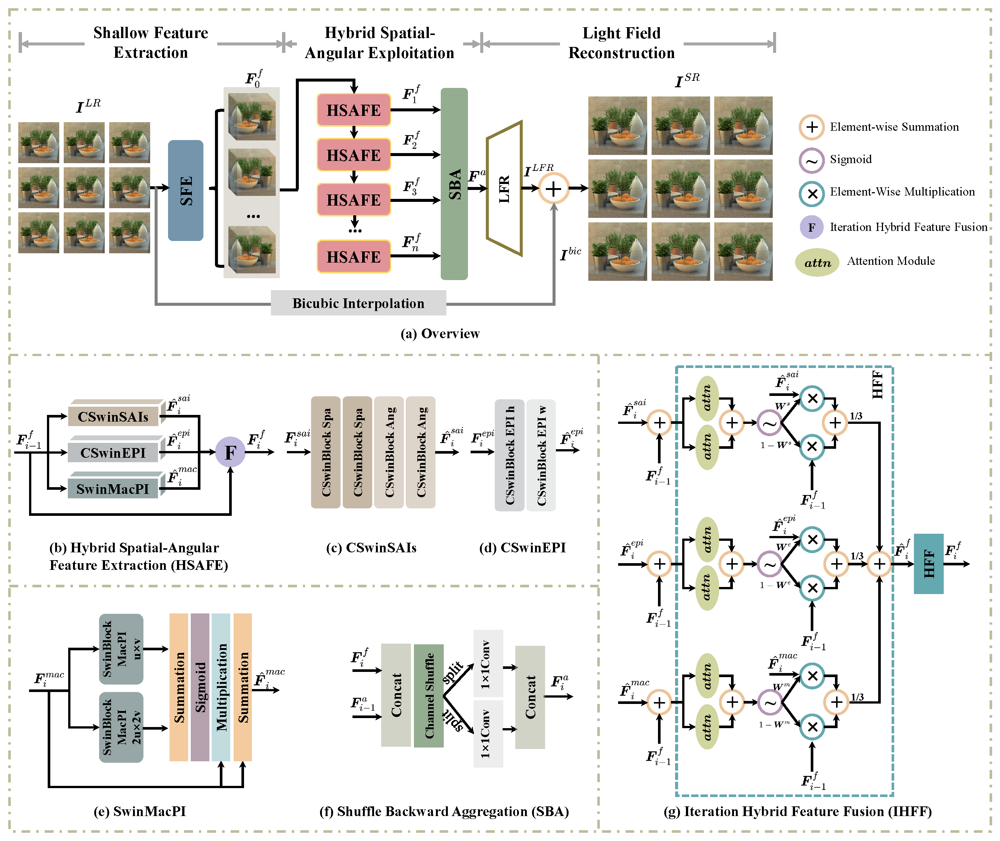

# HSAENet
Hybrid Spatial-Angular Exploitation Network

# Schedule
Release code and models

# Overview
We introduce a novel Hybrid Spatial-Angular Exploitation (HSAE) module to exploit spatial-angular information from multiple light field image representations and then integrate the efficient incorporation of the most relevant information into a comprehensive feature representation. While accounting for the interrelation and disparity among these representations, we propose an adaptive fusion strategy, Iterative Hybrid Feature Fusion (IHFF), allowing for the selective and context-aware integration of diverse feature representations. Additionally, we present an innovative aggregation technique that harnesses both shallow and deep feature aggregation, facilitating the capture of hierarchical contextual information. Based on the above modules, we construct a Hybrid Spatial Angular Exploitation Network termed as **HSAENet**. Compared with the current leading approach EPIT \cite{liang2023learning}, the proposed HSAENet achieves PSNR improvements of **0.20dB** and **0.41dB** on the performance of average values across five datasets for **x2** and **x4**.

